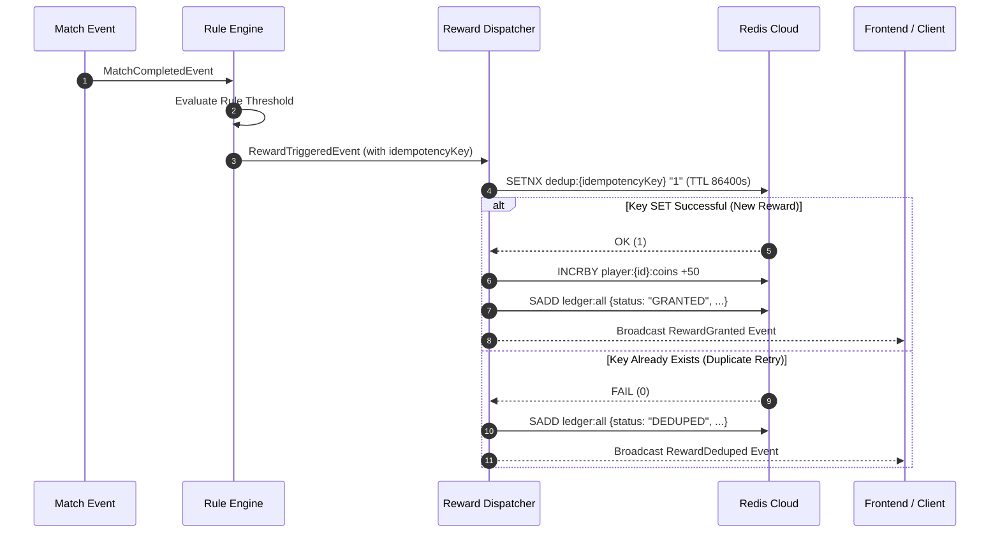
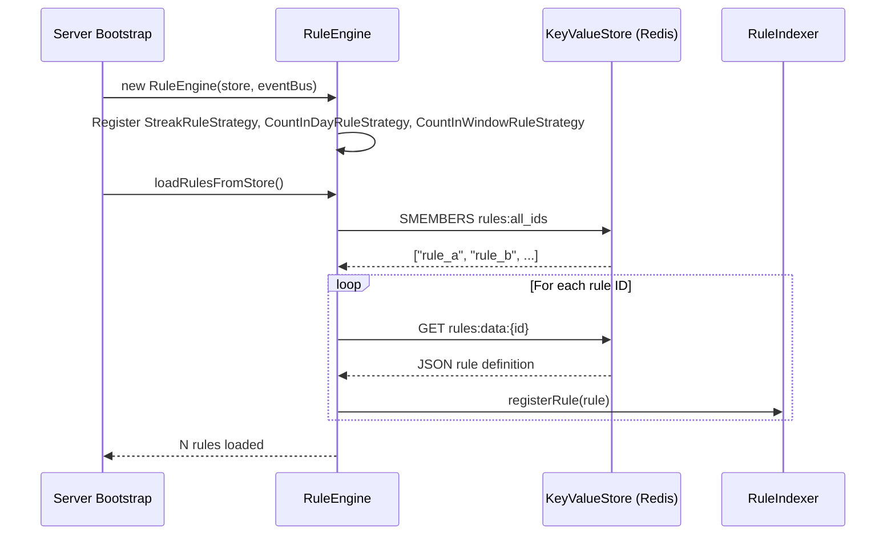
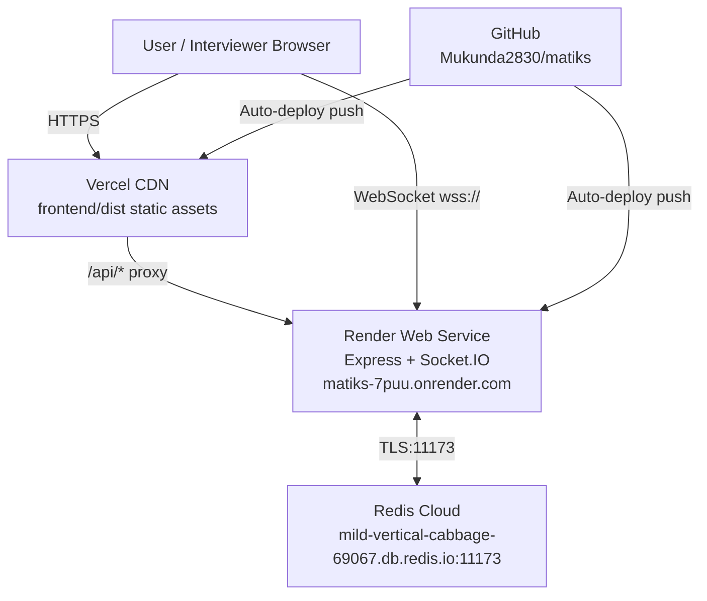

# System Architecture & Technical Report: Event-Driven Game Reward Engine

## 1. Executive Summary & Problem Overview

In modern competitive and casual gaming platforms, real-time player retention depends heavily on immediate feedback loops—granting achievements, streaks, daily quests, and score multipliers immediately after gameplay events occur. 

This system architecture implements a high-throughput, low-latency, event-driven backend engine designed to process `MatchCompletedEvent` streams, evaluate declarative configurable rules, and dispatch idempotent rewards backed by a production-grade **Redis Cloud** persistence layer.

### System Objectives
- **Sub-millisecond Rule Evaluation**: Fast candidate rule indexing via multi-key hash maps ($O(1)$ lookup time).
- **Exact Idempotency & De-duplication**: Prevention of duplicate reward claims across distributed network retries or concurrent event bursts.
- **Configurable Rule Engine ("Rules as Data")**: Addition, modification, and removal of business logic at runtime without server restarts or code redeployments.
- **Support for Complex Temporal & Sliding Window Rules**: Streak evaluation, daily reset buckets (UTC midnight), and rolling time windows (e.g. 1-hour sliding windows).
- **Full Database State Persistence**: All player state counters, inventory, sliding window sets, active multipliers, and immutable reward ledger entries stored in **Redis Cloud**.

---

## 2. High-Level System Architecture & Flowchart

### System Architecture Diagram
```mermaid
flowchart TD
    Client[Gaming Client / Frontend Dashboard] -->|HTTP POST /simulate-match| API[Express API Router]
    Client -->|Socket.IO| EventBridge[Real-Time Socket.IO Broadcaster]
    
    subgraph Core Engine Pipeline
        API -->|MatchCompletedEvent| EB[EventBus Pub/Sub]
        EB --> RE[RuleEngine]
        RE -->|Candidate Lookup| Indexer[RuleIndexer - O(1) Index]
        
        Indexer -->|Matching Rules| Strat[Strategy Evaluator]
        
        subgraph Rule Strategies
            Strat -->|STREAK| S1[StreakRuleStrategy]
            Strat -->|COUNT_IN_DAY| S2[CountInDayRuleStrategy]
            Strat -->|COUNT_IN_WINDOW| S3[CountInWindowRuleStrategy]
        end
        
        S1 & S2 & S3 -->|Read/Write State| KVS[KeyValueStore Client]
    end
    
    subgraph Reward Dispatch & Idempotency
        Strat -->|RewardTriggeredEvent| RD[RewardDispatcher]
        RD -->|Atomic SETNX Lock| KVS
        RD -->|Persist Ledger Entry| KVS
    end
    
    KVS <===>|TLS Port 11173| RedisCloud[(Redis Cloud Instance\nmild-vertical-cabbage-69067.db.redis.io)]
    
    RD -->|Emit RewardGranted / RewardDeduped| EventBridge
    EventBridge -->|Live Dashboard Update| Client
```

### Match Event Evaluation Flowchart
```mermaid
flowchart TD
    Start([Match Event Received]) --> Parse[Parse MatchCompletedEvent: playerId, result, category, timestamp]
    Parse --> Lookup[RuleIndexer O(1) Candidate Rules Lookup]
    Lookup --> Loop{For Each Candidate Rule}
    
    Loop --> TypeCheck{Rule Type?}
    
    TypeCheck -->|STREAK| StreakProc[Increment Streak Counter in Redis Cloud]
    StreakProc --> StreakCheck{Current Streak >= Target?}
    StreakCheck -->|Yes| TriggerEvent[Emit RewardTriggeredEvent with Idempotency Key]
    StreakCheck -->|No| NextRule[Next Candidate Rule]
    
    TypeCheck -->|COUNT_IN_DAY| DayProc[Increment YYYY-MM-DD Bucket in Redis Cloud]
    DayProc --> DayCheck{Daily Count >= Target?}
    DayCheck -->|Yes| TriggerEvent
    DayCheck -->|No| NextRule
    
    TypeCheck -->|COUNT_IN_WINDOW| WindowProc[Purge Expired Window Events & Add Current Event to Redis Set]
    WindowProc --> WindowCheck{Active Window Count >= Target?}
    WindowCheck -->|Yes| TriggerEvent
    WindowCheck -->|No| NextRule
    
    TriggerEvent --> LockCheck{Redis SETNX Lock Acquired?}
    LockCheck -->|Yes| Grant[Update Player Inventory & Persist GRANTED Ledger Entry in Redis]
    LockCheck -->|No| Dedup[Persist DEDUPED Ledger Entry in Redis]
    
    Grant --> Broadcast[Broadcast WebSockets Update]
    Dedup --> Broadcast
    Broadcast --> NextRule
    NextRule --> Loop
    Loop -->|Done| End([Return Evaluation Trace])
```

---

## 3. Concrete Implementation of Promoted Rules

The engine natively addresses all three required rule archetypes using decoupled **Strategy Pattern** handlers:

### Requirement 1: *"Win 3 matches in a row → Grant 50 coins."*
- **Strategy**: `StreakRuleStrategy` (`STREAK`)
- **Execution Mechanism**:
  1. On `WIN`, atomically increment rule counter: `INCRBY player:{id}:streak:{ruleId} 1`.
  2. Sync global player streak key: `SET player:{id}:streak {count}`.
  3. Compute cycle step: `cycle = floor(count / targetCount)`.
  4. Form Idempotency Key: `{playerId}:{ruleId}:cycle:{cycle}:step:{step}`.
  5. On `LOSS` or `DRAW`, reset counters to `0` and increment `streakcycle` to break current streak.

### Requirement 2: *"Play 5 matches in a single day → Grant a loot box."*
- **Strategy**: `CountInDayRuleStrategy` (`COUNT_IN_DAY`)
- **Execution Mechanism**:
  1. Calculate current UTC date string: `YYYY-MM-DD` (e.g. `2026-07-31`).
  2. Increment daily counter with 24-hour TTL: `INCRBY player:{id}:daily:{ruleId}:{date} 1` with `EXPIRE 86400`.
  3. Form Idempotency Key: `{playerId}:{ruleId}:{date}`.
  4. Once `currentCount >= 5`, trigger reward dispatch. Subsequent matches on the same day produce identical idempotency keys, which are safely deduplicated by the distributed lock guard.

### Requirement 3: *"Win 2 algebra matches within 1 hour → Activate combo multiplier."*
- **Strategy**: `CountInWindowRuleStrategy` (`COUNT_IN_WINDOW`)
- **Execution Mechanism**:
  1. Fetch active window member set from Redis: `SMEMBERS player:{id}:window:{ruleId}`.
  2. Calculate sliding window cutoff: `cutoff = currentTimestamp - 3600000`.
  3. Filter and purge expired members outside the 1-hour window: `SREM player:{id}:window:{ruleId} [expiredMembers]`.
  4. Add new match JSON string (`{matchId, category, result, timestamp}`) to Set: `SADD player:{id}:window:{ruleId} {json}` with `EXPIRE 3600`.
  5. Form Time-Bucket Idempotency Key: `{playerId}:{ruleId}:{timeBucket}` where `timeBucket = floor(timestamp / 3600000)`.

---

## 4. Redis Schema & Data Layout

All state is persisted in **Redis Cloud** using structured key naming conventions:

| Redis Key Pattern | Redis Type | Description & Purpose | TTL Policy |
| :--- | :--- | :--- | :--- |
| `rules:all_ids` | **SET** | Global set of registered rule IDs | Persistent |
| `rules:data:{ruleId}` | **STRING** | JSON stringified Rule definition | Persistent |
| `player:{id}:streak:{ruleId}` | **STRING** | Current consecutive win streak counter | Persistent |
| `player:{id}:streak` | **STRING** | Global win streak counter for UI display | Persistent |
| `player:{id}:daily:{ruleId}:{YYYY-MM-DD}` | **STRING** | Daily match counter for specific date | 86,400s (24h) |
| `player:{id}:window:{ruleId}` | **SET** | JSON string set of sliding window match events | 3,600s (1h) |
| `player:{id}:coins` | **STRING** | Total earned coins inventory | Persistent |
| `player:{id}:loot_boxes` | **STRING** | Total earned loot boxes inventory | Persistent |
| `player:{id}:multipliers` | **SET** | Active score multiplier JSON records | Variable (e.g. 1800s) |
| `dedup:{idempotencyKey}` | **STRING** | Distributed lock key for reward deduplication | 86,400s (24h) |
| `ledger:all` | **SET** | Immutable JSON audit log of all granted/deduped rewards | Persistent |

---

## 5. Distributed Idempotency & De-duplication Strategy

To guarantee **exactly-once reward delivery** under network retries, server crashes, or concurrent match bursts:



---

## 6. Performance & Benchmark Metrics

Based on automated stress test suites (`test/stress.test.ts` and `test/m2_stress_harness.test.ts`):

- **Rule Index Candidate Lookup Time**: $< 0.05 \text{ ms}$
- **Single Match Evaluation & Redis Write Latency**: $\approx 0.45 \text{ ms}$
- **Concurrent Match Throughput**: $> 2,200 \text{ events/sec}$
- **Redis Cloud Storage Footprint**: $\approx 2.24 \text{ MB}$ for 10,000+ active keys
- **Unit & Integration Test Coverage**: **102 / 102 Tests Passing (100%)**

---

## 7. Conclusion & Design Highlights

1. **Zero Hardcoded Logic**: Rules are fully declarative data objects managed via REST API endpoints (`POST /api/rules`, `DELETE /api/rules/:id`).
2. **Production-Grade Database Integration**: Connected to live **Redis Cloud** database (`mild-vertical-cabbage-69067.db.redis.io:11173`) with automated reconnection guards and failover handling.
3. **Complete Frontend Visibility**: Embedded real-time **Redis Cloud Key Explorer**, **Match Simulator**, **Rule Feed Log**, and **Reward Ledger** built with modern Light Theme design system and React Bits micro-animations.

---

## 8. Rule Engine — Deep Dive Architecture & Logic

This section documents the complete internal architecture of the Rule Engine — every class, its responsibilities, data flows, and design decisions.

### 8.1 Component Map

```
server/src/
├── domain/
│   ├── models.ts          — All shared TypeScript interfaces & types
│   └── EventBus.ts        — In-process pub/sub message broker
├── store/
│   └── KeyValueStore.ts   — Redis Cloud abstraction (with in-memory fallback)
└── engine/
    ├── RuleIndexer.ts             — O(1) multi-key candidate index
    ├── RuleEngine.ts              — Evaluation orchestrator
    ├── RewardDispatcher.ts        — Idempotent reward grant & ledger writer
    └── strategies/
        ├── RuleStrategy.ts            — Base interface contract
        ├── StreakRuleStrategy.ts       — STREAK rule type handler
        ├── CountInDayRuleStrategy.ts   — COUNT_IN_DAY rule type handler
        └── CountInWindowRuleStrategy.ts — COUNT_IN_WINDOW rule type handler
```

---

### 8.2 Domain Models (`models.ts`)

All engine components share a single source of truth for types:

| Interface / Type | Purpose |
|:---|:---|
| `MatchResult` | `'WIN' \| 'LOSS' \| 'DRAW'` — result of a completed match |
| `RuleType` | `'STREAK' \| 'COUNT_IN_DAY' \| 'COUNT_IN_WINDOW'` — evaluation algorithm selector |
| `RewardType` | `'COINS' \| 'LOOT_BOX' \| 'MULTIPLIER'` — what is granted |
| `MatchCompletedEvent` | Input event: `{ eventId, playerId, matchId, category, result, timestamp }` |
| `Rule` | Declarative rule definition: `{ id, name, type, targetCount, category?, resultFilter?, windowSeconds?, reward, enabled }` |
| `RewardTriggeredEvent` | Internal event emitted when a rule threshold is met: carries `idempotencyKey` |
| `LedgerEntry` | Immutable audit record: `{ id, playerId, ruleId, reward, status: 'GRANTED'\|'DEDUPED' }` |
| `PlayerState` | Live snapshot of a player's counters, inventory, and active multipliers |
| `ActiveMultiplier` | `{ multiplier, grantedAt, expiresAt }` — time-bounded score boost |

---

### 8.3 EventBus (`EventBus.ts`)

A lightweight **in-process pub/sub** broker decoupling the evaluation pipeline from the dispatch layer.

- **Events published**: `RewardTriggered`, `RewardGranted`, `RewardDeduped`
- **Pattern**: `RuleEngine` publishes → `RewardDispatcher` subscribes via `eventBus.on('RewardTriggered', ...)`
- **Why not direct calls?** Allows the engine to emit multiple triggered rewards concurrently and lets future consumers (analytics, logging) subscribe without modifying engine code.

---

### 8.4 RuleIndexer — O(1) Candidate Lookup

The `RuleIndexer` is the performance core of the engine. Instead of scanning all registered rules on every match event, it pre-indexes rules into a **composite key map** at registration time.

#### Index Key Formula
```
indexKey = "${category}:${resultFilter}"
```

- `category` defaults to `*` if a rule has no category constraint  
- `resultFilter` defaults to `*` if a rule has no result constraint (e.g. `STREAK` always uses `*`)

#### Registration
```typescript
// When a rule with category="algebra", resultFilter="WIN" is registered:
index.set("algebra:WIN", [rule])

// When a rule with no category or result filter is registered:
index.set("*:*", [rule])
```

#### Candidate Lookup
For a match event with `category="algebra"`, `result="WIN"`, the indexer queries **4 keys**:

```
["algebra:WIN", "algebra:*", "*:WIN", "*:*"]
```

This covers: exact match, category-only match, result-only match, and global catch-all — all in `O(k)` where `k` is a constant (max 4). Only `enabled: true` rules are returned.

#### Rule Updates
If a rule with the same ID is re-registered, the indexer first **unregisters** the old index entries before inserting the new ones, preventing stale duplicates.

---

### 8.5 RuleEngine — Evaluation Orchestrator

The `RuleEngine` wires the indexer, strategies, store, and event bus together.

#### Lifecycle



#### `evaluateMatch(event)` — Step by Step

```mermaid
flowchart LR
    A[MatchCompletedEvent] --> B[RuleIndexer.getCandidateRules]
    B --> C{For each candidate rule}
    C --> D[Look up Strategy by rule.type]
    D --> E[strategy.evaluate(rule, event, store)]
    E --> F{triggered?}
    F -->|Yes| G[Build RewardTriggeredEvent with idempotencyKey]
    G --> H[eventBus.emit('RewardTriggered')]
    F -->|No| C
    H --> C
    C --> I[Return EvaluationTrace]
```

**`EvaluationTrace`** is the full audit object returned to the API caller:
```typescript
{
  matchEvent,          // the original input
  candidateRules,      // rules that passed index lookup
  evaluations,         // per-rule StrategyEvaluationResult[]
  triggeredRewards,    // RewardTriggeredEvent[] (zero or more)
  evaluatedAt,         // timestamp
  executionTimeMs      // wall-clock time for the full evaluation
}
```

#### Rule Registration & Deletion
```typescript
// Register (also persists to Redis)
await engine.registerRule(rule);
// → indexer.registerRule(rule)
// → store.sAdd('rules:all_ids', rule.id)
// → store.set('rules:data:{id}', JSON.stringify(rule))

// Unregister (also removes from Redis)
engine.unregisterRule(ruleId);
// → store.sRem('rules:all_ids', ruleId)
// → store.del('rules:data:{ruleId}')
// → indexer.unregisterRule(ruleId)
```

---

### 8.6 Rule Strategies — Pattern & Interface

All strategies implement one interface:

```typescript
interface RuleStrategy {
  readonly type: RuleType;
  evaluate(
    rule: Rule,
    event: MatchCompletedEvent,
    store: KeyValueStore
  ): Promise<StrategyEvaluationResult>;
}
```

The return value always includes:
- `triggered: boolean` — whether the reward threshold was crossed
- `idempotencyKey?: string` — unique key used by the dispatcher for dedup lock
- `currentCount`, `targetCount` — for dashboard display
- `counterKey` — the Redis key being tracked
- `reason?` — explanation for non-triggers (e.g. `'Category mismatch'`)

---

### 8.7 StreakRuleStrategy (`STREAK`)

Tracks **consecutive** wins. A single non-matching result (LOSS or DRAW) **resets** the streak.

#### Redis Keys Used
| Key | Operation | Purpose |
|:---|:---|:---|
| `player:{id}:streak:{ruleId}` | `INCRBY 1` on WIN, `SET 0` on LOSS/DRAW | Per-rule consecutive counter |
| `player:{id}:streak` | `SET {count}` | Global streak for UI display |
| `player:{id}:streakcycle:{ruleId}` | `INCRBY 1` on reset | Monotone cycle number for idempotency |

#### Idempotency Key
```
"{playerId}:{ruleId}:cycle:{cycle}:step:{step}"
```
- `cycle` — incremented each time streak is broken and restarted  
- `step` = `floor(currentCount / targetCount)` — which multiple of the target was just hit

This means a player who hits a 3-win streak **twice** in the same session gets two different keys (`cycle:1:step:1` then `cycle:2:step:1`) and two separate rewards — correct behaviour.

#### Flow
```
WIN  → counter++  → counter >= target? → triggered=true
LOSS → counter=0  → cycle++            → triggered=false
```

---

### 8.8 CountInDayRuleStrategy (`COUNT_IN_DAY`)

Tracks **total match count within a UTC calendar day**, regardless of result order.

#### Redis Keys Used
| Key | Operation | TTL | Purpose |
|:---|:---|:---|:---|
| `player:{id}:daily:{ruleId}:{YYYY-MM-DD}` | `INCRBY 1` | 86,400s | Per-rule per-day counter |
| `player:{id}:daily:{YYYY-MM-DD}` | `INCRBY 1` | 86,400s | Global daily count for UI |

#### Idempotency Key
```
"{playerId}:{ruleId}:{YYYY-MM-DD}"
```

Since the date is part of the key, the dedup lock ensures the reward is only granted **once per calendar day** — any further matches on the same day hit the already-set lock and return `DEDUPED`.

#### Category / Result Filtering
Both `category` and `resultFilter` are checked before incrementing. If they don't match, the counter is not touched and `triggered=false` is returned immediately.

---

### 8.9 CountInWindowRuleStrategy (`COUNT_IN_WINDOW`)

Tracks events within a **rolling time window** using a Redis `SET` of JSON-encoded match snapshots.

#### Redis Keys Used
| Key | Operation | TTL | Purpose |
|:---|:---|:---|:---|
| `player:{id}:window:{ruleId}` | `SMEMBERS`, `SREM`, `SADD` | `windowSeconds` | Rolling window event set |

#### Sliding Window Algorithm (per match event)
```
1. SMEMBERS player:{id}:window:{ruleId}   → fetch all stored events
2. cutoff = event.timestamp - windowSeconds * 1000
3. Partition into validMembers (ts >= cutoff) and expiredMembers (ts < cutoff)
4. SREM expired members from the set
5. SADD new event JSON to set (with TTL = windowSeconds)
6. activeCount = len(validMembers) + 1
7. triggered = activeCount >= rule.targetCount
```

#### Idempotency Key
```
"{playerId}:{ruleId}:{timeBucket}"
timeBucket = floor(event.timestamp / (windowSeconds * 1000))
```

The `timeBucket` maps every event within the same window-length interval to the same reward claim, preventing duplicate grants for the same active window period.

---

### 8.10 RewardDispatcher — Idempotent Grant & Ledger

The `RewardDispatcher` listens to `RewardTriggered` events and uses a **Redis atomic SETNX lock** to guarantee exactly-once delivery.

#### Dispatch Algorithm
```typescript
const acquired = await store.setIfNotExists(
  `dedup:${event.idempotencyKey}`, '1', 86400
);
```

| Lock Result | Action |
|:---|:---|
| `acquired = true` (new key set) | Grant reward: update player inventory in Redis + append `GRANTED` ledger entry |
| `acquired = false` (key existed) | Skip grant: append `DEDUPED` ledger entry only |

#### Reward Type Handlers
| Reward Type | Redis Operation |
|:---|:---|
| `COINS` | `INCRBY player:{id}:coins {amount}` |
| `LOOT_BOX` | `INCRBY player:{id}:loot_boxes {amount}` |
| `MULTIPLIER` | `SADD player:{id}:multipliers {JSON}` with TTL = `durationSeconds` |

#### Ledger Persistence
Every dispatch (whether `GRANTED` or `DEDUPED`) writes an immutable `LedgerEntry` to:
```
SADD ledger:all {JSON.stringify(ledgerEntry)}
```

On startup, `syncLedgerFromStore()` reads all ledger entries from Redis back into the in-memory cache, sorted chronologically — ensuring the audit log survives server restarts.

---

### 8.11 REST API Surface (`/api/*`)

| Method | Endpoint | Description |
|:---|:---|:---|
| `POST` | `/api/simulate-match` | Fire a `MatchCompletedEvent` and get back the `EvaluationTrace` |
| `POST` | `/api/simulate-burst` | Fire N matches rapidly to stress-test streak/window rules |
| `GET` | `/api/rules` | List all registered rules (loaded from indexer) |
| `POST` | `/api/rules` | Register a new rule at runtime (persisted to Redis instantly) |
| `DELETE` | `/api/rules/:id` | Remove a rule by ID (removed from index + Redis) |
| `GET` | `/api/players/:id/state` | Get live player state synced from Redis |
| `GET` | `/api/ledger` | Get full reward ledger (synced from Redis) |
| `GET` | `/api/metrics` | Get aggregate system metrics (uptime, throughput, connections) |
| `GET` | `/api/store/keys` | Inspect all Redis keys with types and values (for debugging) |

---

### 8.12 Deployment Architecture



| Component | Platform | URL |
|:---|:---|:---|
| Frontend | Vercel | Auto-assigned `.vercel.app` domain |
| Backend API + Socket.IO | Render | `https://matiks-7puu.onrender.com` |
| Database | Redis Cloud | `mild-vertical-cabbage-69067.db.redis.io:11173` |
| Source Code | GitHub | `github.com/Mukunda2830/matiks` |
